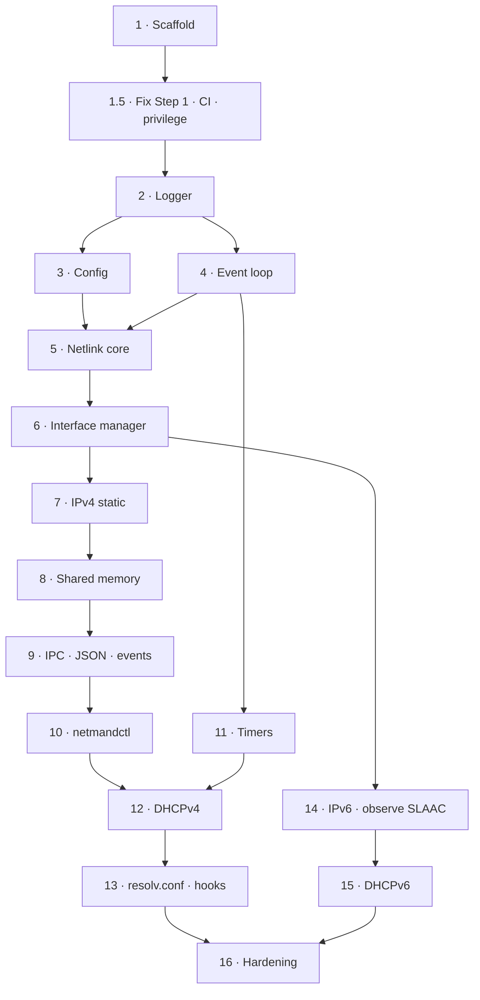
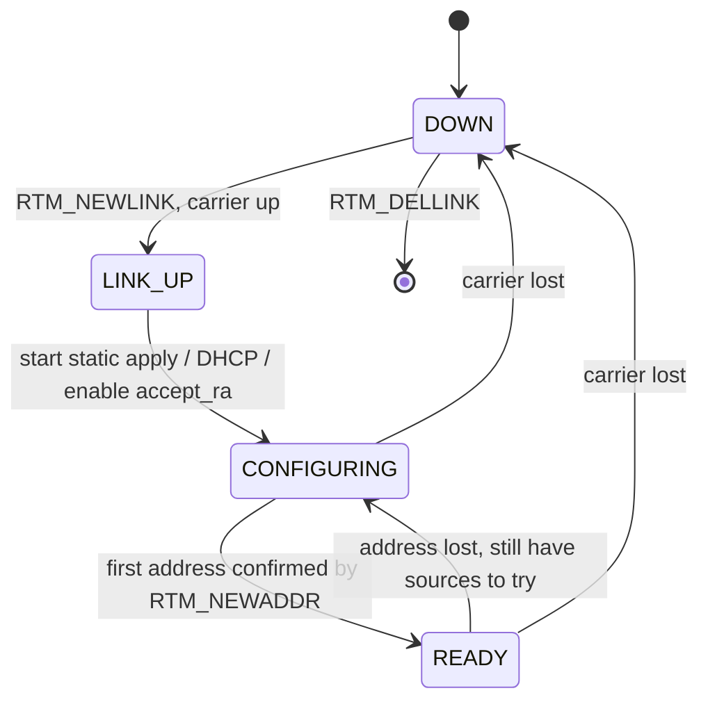
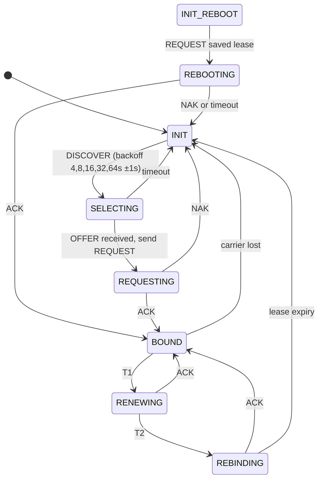

# netmand — Implementation & Testing Plan

A step-by-step development plan for the `netmand` network management daemon, organized so that **every step produces testable, runnable code**. Each step builds on the previous one; no step requires forward references.

**Revision 2.** Revised after a verification pass against the actual tree at Step 1. See [Revision History](#revision-history) for what changed and why.

---

## Current Status

| | |
|---|---|
| **Built** | Steps 1 and 1.5 — `Makefile` (incl. `make check`), `conf/netmand.conf`, [src/core/main.c](../src/core/main.c), [src/core/main.h](../src/core/main.h), [src/core/priv.c](../src/core/priv.c) / [priv.h](../src/core/priv.h) |
| **Empty** | `tests/`, `tools/` |
| **Verified** | Clean under `-std=c99 -Wall -Wextra -Werror -pedantic` on gcc and under ASan/UBSan; daemonizes, honours PID-file ownership, drops to `cap_net_admin,cap_net_raw` |
| **Next** | Step 2 — logger (ring buffer + multi-sink) |

---

## Architecture Decisions

These are the load-bearing decisions. Everything downstream assumes them; changing one means revisiting the steps that cite it.

### AD-1 — The interface manager is the hub

Every address source (static, DHCPv4, DHCPv6, kernel SLAAC) is a **policy plugin** that reports into a single per-interface state machine in `src/iface/`. The iface manager is the *only* component that writes shared memory and publishes events.

Without this there is no answer to: who re-applies an address after a link bounce; who arbitrates static vs DHCP on one interface; who owns the default route when two interfaces both have one; where the shared-memory writer reads its data from. Revision 1 of this plan had no such object, and every module after Step 5 was implicitly assuming one existed.

### AD-2 — Netlink is the source of truth; reconcile, never assume

All state changes go *out* via netlink, but internal state only advances when the corresponding `RTM_NEWADDR` / `RTM_DELADDR` multicast notification comes *back*. The daemon converges on what the kernel actually did, not on what it asked for.

This makes netmand self-healing when an operator runs `ip addr del` by hand, and it removes an entire class of "we think it's configured but it isn't" bugs. Cost: one extra hop of latency on every change, and the code must tolerate its own echoes.

### AD-3 — Two netlink sockets

One **event socket** (subscribed to `RTMGRP_LINK | RTMGRP_IPV4_IFADDR | RTMGRP_IPV6_IFADDR | RTMGRP_IPV4_ROUTE`) that only ever reads, and one **request socket** for dumps and set operations.

A single socket interleaves `RTM_GETLINK` dump replies with multicast events; draining the dump then loses or misparses events that arrive mid-dump. Two sockets make the bug unrepresentable.

### AD-4 — Shared memory uses a seqlock, not a `pthread_rwlock_t`

A `pthread_rwlock_t` inside the shm region deadlocks **every reader, permanently**, if the daemon dies holding the write lock — and unlike mutexes, rwlocks have no `PTHREAD_MUTEX_ROBUST` equivalent. It also bakes libc ABI (glibc vs musl vs uClibc — all common on Buildroot) into a struct shared across separately-compiled processes, and it makes the "zero-syscall reads" claim false, since contention means a futex.

A seqlock is correct here because the daemon is single-threaded, i.e. single-writer. It is lock-free for readers, crash-safe, genuinely syscall-free, carries no libc ABI, and lets `-lpthread` drop out of `LDLIBS` entirely.

### AD-5 — The kernel owns SLAAC; netmand observes it

netmand does **not** send Router Solicitations or parse Router Advertisements. It sets `net.ipv6.conf.<if>.accept_ra` and `addr_gen_mode`, lets the kernel do RS/RA/address generation/DAD/default route, and learns the resulting addresses from `RTM_NEWADDR` on the event socket, tagging them `ADDR_SRC_SLAAC`.

Revision 1 reimplemented all of this in userspace without disabling the kernel's own SLAAC — the two would have raced and produced conflicting addresses. Doing it properly would additionally require DAD result handling (`IFA_F_TENTATIVE`, `IFA_F_DADFAILED`), RA router-lifetime default routes, and RFC 7217 stable-privacy addressing to avoid leaking the MAC. The kernel already does all of it, correctly. This decision deletes `src/slaac/` — roughly 800 LOC and the entire ICMPv6 raw-socket attack surface.

### AD-6 — One timerfd, not one per timer

A single `timerfd` on `CLOCK_MONOTONIC` plus a sorted deadline list, rearmed to the nearest deadline. Revision 1 gave every timer its own fd and epoll registration, capped at 32 — 32 file descriptors in a daemon whose entire selling point is a small footprint.

`CLOCK_MONOTONIC` throughout: embedded boards routinely have no RTC until NTP lands, and a wall-clock jump must not disturb a DHCP lease timer.

### AD-7 — JSON stays on the wire, parsed by a hand-rolled strict parser

~200 LOC, strict recursive descent, restricted to flat objects with string and number values, hard caps on total length and key count, **no malloc**, fuzzed from the day it is written.

Vendoring cJSON would add ~1.5k LOC of malloc-heavy general-purpose parsing, plus a third-party CVE surface, to a root daemon whose entire command vocabulary is five verbs with at most three scalar fields each.

### AD-8 — Least privilege from Step 1.5, not from the hardening step

The daemon parses attacker-controlled input — DHCP options and DHCPv6 replies arrive from the wire — while holding root. Capabilities are dropped to `CAP_NET_ADMIN` + `CAP_NET_RAW` immediately after socket setup. This is a Step 1.5 concern, not a Step 16 concern.

### AD-9 — Protocol code is I/O-free

Every wire protocol is expressed as `parse(buf, len) -> struct` and `build(struct, buf, len) -> ssize_t`, with no socket calls inside. Sockets live in the module's `_io.c`. This is what makes netlink, DHCPv4, DHCPv6, and JSON unit-testable and fuzzable without a network.

---

## Development Flow



> [!IMPORTANT]
> The ordering difference from Revision 1: **observability comes before DHCP.** Shared memory, IPC, and `netmandctl` are all working before the DHCPv4 state machine is written, so the hardest module in the project can be debugged by asking the daemon what it thinks, instead of by reading `fprintf` output.

---

## Step 1 — Scaffold, Makefile & `main.c` Skeleton

**Status: built.** Files: [Makefile](../Makefile), [src/core/main.c](../src/core/main.c), [src/core/main.h](../src/core/main.h), [conf/netmand.conf](../conf/netmand.conf).

### What was built

| File | Purpose |
|---|---|
| [Makefile](../Makefile) | `make`, `make tests`, `make clean`, `make install`. `CC`/`CFLAGS`/`LDFLAGS` for cross-compile. Output to `build/` |
| [src/core/main.c](../src/core/main.c) | `main()`: CLI args (`-c`, `-f`, `-p`, `-v`, `-h`), PID file, `signalfd` for `SIGTERM`/`SIGINT`/`SIGHUP`, epoll loop |
| [src/core/main.h](../src/core/main.h) | `netmand_ctx_t`, `epoll_handler_t`, event-loop API |

### Verification Criteria

- [x] `make` compiles without warnings (`-Wall -Wextra -Werror -pedantic`) — **verified**, gcc 15.2.1
- [x] `make clean` removes all artifacts
- [x] `SIGHUP` is caught and sets `reload_pending`
- [x] Daemon starts, writes PID file, enters loop, exits on `SIGTERM` — was **partially false** at Step 1 (the PID file landed in the wrong place and daemonization never ran); **fixed in Step 1.5**.

---

## Step 1.5 — Fix Step 1, add CI, set the privilege model

**Status: built.** Three real bugs and two design smells in shipped code. Fixed before nine more modules copy the patterns.

### Bugs

**1.5.1 — `daemonize()` is unreachable.**
[src/core/main.c:284](../src/core/main.c) sets `ctx->foreground = true` as the *default*, and the `-f` case at [line 291](../src/core/main.c) sets it to `true` again. `main()` only calls `daemonize()` when `!foreground`, so the daemon never forks — and the README init script (`netmand -c ... &`, no `-f`) depends on it.

```c
/* parse_args(), defaults block */
ctx->foreground = false;    /* was: true */
```

**1.5.2 — Shutdown unlinks a *live* daemon's PID file.**
When `write_pid_file()` finds another instance running it returns -1 ([src/core/main.c:190-194](../src/core/main.c)); `main()` jumps to `cleanup:`, which unconditionally calls `remove_pid_file()` ([src/core/main.c:383](../src/core/main.c)). The second instance exits *and takes the running daemon's PID file with it*, so the init script can no longer stop the real daemon.

Add `bool pid_file_owned` to `netmand_ctx_t`, set it on successful write, and gate the unlink on it.

**1.5.3 — PID path is relative.**
`NETMAND_PID_FILE "netmand.pid"` ([src/core/main.h:21](../src/core/main.h)) contradicts this plan, the README init script (`/var/run/netmand.pid`), and `daemonize()`'s own `chdir("/")` — which would place it at `/netmand.pid`. Change to `/var/run/netmand.pid`.

### Design smells

**1.5.4 — Kill the file-scope global.**
`static epoll_handler_t signal_handler_entry;` ([src/core/main.c:107](../src/core/main.c)) directly contradicts `main.h`'s stated "no global state" contract, and every subsequent module will copy it. Embed handler structs in `netmand_ctx` — or better, in each module's own context struct, which hangs off `ctx`.

**1.5.5 — `event_loop_add()` takes `fd` twice.**
The signature is `event_loop_add(ctx, fd, events, handler)` while `handler->fd` must also be set, consistently, by the caller. Drop the parameter and read it from the handler:

```c
int event_loop_add(netmand_ctx_t *ctx, epoll_handler_t *h, uint32_t events);
```

### Build & config hygiene

- **`CFLAGS ?=` silently discards the warning flags.** An inherited `CFLAGS` environment variable replaces the whole line, taking `-Wall -Wextra -Werror` with it. Use `CFLAGS := <base>` plus `CFLAGS += $(EXTRA_CFLAGS)` for caller additions.
- **`.gitignore`** holds only `build/` (and no trailing newline). Add `*.o`, `*.d`, `netmand.pid`, `*.log`.
- **`conf/netmand.conf` paths are relative** (`log/netmand.log`, `netmand_state`, `netmand.sock`), contradicting the README, and `shm_path` **must** begin with `/` for `shm_open`. Change to `/var/log/netmand.log`, `/netmand_state`, `/var/run/netmand.sock`.

### Privilege model (AD-8)

Decide and implement now, so every later module inherits it:

- Retain `CAP_NET_ADMIN` (netlink address/route/link changes) and `CAP_NET_RAW` (`AF_PACKET` for DHCPv4), drop everything else via `capset` after sockets are opened.
- `prctl(PR_SET_NO_NEW_PRIVS, 1)`.
- Document in the README that netmand must start as root but does not stay fully privileged.

### CI (`make check`)

Wire this up now — cross-compile breakage found at Step 16 is expensive; found at Step 2 it is a one-line fix.

```make
check:
	$(MAKE) clean && $(MAKE) CC=gcc
	$(MAKE) clean && $(MAKE) CC=clang
	$(MAKE) clean && $(MAKE) EXTRA_CFLAGS="-fsanitize=address,undefined -g" tests
	$(MAKE) clean && $(MAKE) CC=arm-linux-gnueabihf-gcc   # cross-build only
```

### Verification Criteria

- [x] `netmand` with no `-f` forks, detaches, and writes its PID file — **verified**, own session, no controlling tty
- [x] Starting a second instance fails **and leaves the first instance's PID file intact** — **verified** via `pid_file_owned`
- [x] No file-scope variables remain in `src/core/` — the signalfd handler now lives in `netmand_ctx`
- [x] `make check` passes on gcc and under ASan/UBSan; clang and `arm-linux-gnueabihf-gcc` are **not installed on this host** and are reported as skipped, not silently passed
- [x] `/proc/<pid>/status` shows only `cap_net_admin` and `cap_net_raw` in `CapEff` — **verified** (`CapPrm`/`CapEff`/`CapBnd` = `0x3000`, `CapInh` = 0, `NoNewPrivs` = 1), exercised under `unshare -Ur` since this host has no passwordless root

> [!NOTE]
> Capability dropping lives in [src/core/priv.c](../src/core/priv.c), using the raw `capget`/`capset` syscalls rather than linking libcap. It drops the bounding set *before* `capset`, because shrinking it needs `CAP_SETPCAP` — which the `capset` itself takes away. Started unprivileged it retains nothing and logs a warning, so unit tests and developer shells still run.

---

## Step 2 — Logger (Ring Buffer + Multi-Sink)

### What to Build

| File | Purpose |
|---|---|
| `src/logger/logger.h` | `log_init()`, `log_write()`, `log_set_level()`, `log_add_sink()`, level enum, `LOG_*` macros |
| `src/logger/logger.c` | Ring buffer + sink dispatch: syslog, stderr, file, callback |
| `tests/test_logger.c` | Unit test |

### Design Notes

```c
typedef struct {
    int      level;
    uint64_t timestamp_us;    /* CLOCK_MONOTONIC — see AD-6 */
    char     msg[LOG_MSG_MAX];
} log_entry_t;

typedef struct {
    log_entry_t entries[LOG_RING_SIZE];
    uint32_t    head;         /* monotonic write counter; index = head & (SIZE-1) */
} log_ring_t;
```

**What the ring is actually for.** The daemon is single-threaded and flushes sinks synchronously, so the ring is not a queue — it is a *retrospective buffer*, so `netmandctl log` (Step 10) can dump the last N messages from a daemon whose sinks were set to `syslog` on a box with no syslog. State this in the header, or the next reader will assume it is an async queue and add a flush thread.

- Revision 1's struct carried a single `tail` while the prose said "per-sink tail". There is no tail: sinks are written through immediately, and the ring is read only by explicit dump. `head` alone, monotonically increasing, with masking for the index.
- `LOG_RING_SIZE` and `LOG_MSG_MAX` compile-time; **default 64 × 128 B = 8 KiB**, not Revision 1's 256 × 256 B = 64 KiB. This is an embedded target where 64 KiB of static BSS for log scrollback is a real cost.
- Logging must never allocate and never block. `vsnprintf` into the ring slot, then dispatch.
- File sink: append mode, rotate at a configurable size (default 1 MiB), single `.old` generation. Note in the code that this is flash — rotation churn matters.

### Testing

| Test Case | Validates |
|---|---|
| `test_log_levels` | Messages below threshold are dropped |
| `test_ring_wrap` | Ring wraps, oldest entries evicted, `head` keeps counting |
| `test_truncation` | A message longer than `LOG_MSG_MAX` truncates without overflow |
| `test_stderr_sink` | Output appears on stderr |
| `test_file_sink` | Output written to temp file, content matches |
| `test_file_rotation` | Exceeding the size cap rotates and keeps logging |
| `test_callback_sink` | Custom callback receives correct level + message |
| `test_multiple_sinks` | Same message delivered to all active sinks |

### Verification Criteria

- [ ] All test cases pass under ASan and UBSan
- [ ] Valgrind reports zero leaks
- [ ] `main.c` uses `LOG_*` throughout; no `fprintf` remains outside pre-logger-init failure paths

---

## Step 3 — INI Config Parser

### What to Build

| File | Purpose |
|---|---|
| `src/core/config.h` | `struct daemon_config`, `struct iface_config`, parser API |
| `src/core/config.c` | Line-oriented INI parser: `[section]`, `key = value`, `;` comments, whitespace trimming |
| `tests/test_config.c` | Unit test |

### Data Structures

```c
struct iface_config {
    char name[IFNAMSIZ];

    enum { METHOD4_OFF, METHOD4_STATIC, METHOD4_DHCP } ipv4_method;
    uint32_t static_addr;        /* network byte order */
    uint8_t  static_prefix;
    uint32_t static_gateway;

    /* AD-5: SLAAC means "let the kernel do it and watch"; there is no
     * userspace RA path. DHCPV6 and SLAAC may both be active. */
    enum { METHOD6_OFF, METHOD6_STATIC, METHOD6_SLAAC, METHOD6_DHCPV6 } ipv6_method;
    uint8_t  static_addr6[16];   /* binary — see AD-4 */
    uint8_t  static_prefix6;

    char     up_script[128];     /* Step 13; empty = none */
};

struct daemon_config {
    int      log_level;
    uint32_t log_sinks;          /* bitmask */
    char     log_file[128];
    char     shm_path[64];       /* must start with '/' */
    char     socket_path[108];   /* sun_path limit */
    bool     manage_resolv;      /* Step 13 */
    int      iface_count;
    struct iface_config ifaces[NETMAND_MAX_IFACES];
};
```

- **Reload is a whole-struct swap.** `config_load(path) -> struct daemon_config *` allocates and parses into a fresh struct; `SIGHUP` parses into a new one and swaps the pointer in `netmand_ctx` only if parsing fully succeeded. A malformed config on reload must leave the running config untouched — never half-applied.
- The iface manager (Step 6) diffs old against new and applies only what changed. This is why reload is a swap and not an in-place mutation.
- `[eth0.ipv6]` sections attach to the parent `[eth0]`; a `.ipv6` section with no parent is an error, not a silent ignore.

### Testing

| Test Case | Validates |
|---|---|
| `test_parse_daemon_section` | log_level, log_sinks bitmask, paths |
| `test_parse_static_iface` | IPv4 address, prefix, gateway |
| `test_parse_dhcp_iface` | `method = dhcp` sets the enum |
| `test_parse_ipv6_section` | `[eth0.ipv6]` maps onto the parent iface |
| `test_orphan_ipv6_section` | `[eth9.ipv6]` with no `[eth9]` is rejected |
| `test_missing_file` | Returns error, does not crash |
| `test_malformed_lines` | Bad lines skipped with a warning; the rest still parse |
| `test_oversized_values` | A 500-char path truncates safely, no overflow |
| `test_relative_shm_path` | `shm_path` without a leading `/` is rejected |
| `test_reload_atomicity` | Parsing a broken file leaves the previous config in place |

### Verification Criteria

- [ ] All test cases pass under ASan
- [ ] Example `conf/netmand.conf` parses cleanly
- [ ] `main.c` loads config at startup and logs the interface count
- [ ] Fuzz target `fuzz_config` runs 10 min without a crash (AD-9)

---

## Step 4 — Epoll Event Loop Core

Extend [src/core/main.c](../src/core/main.c) into a proper loop. Mostly built; this step finishes it.

```c
int  event_loop_add(netmand_ctx_t *ctx, epoll_handler_t *h, uint32_t events);
int  event_loop_mod(netmand_ctx_t *ctx, epoll_handler_t *h, uint32_t events);
int  event_loop_remove(netmand_ctx_t *ctx, epoll_handler_t *h);
void event_loop_run(netmand_ctx_t *ctx);
```

- `event_loop_mod()` is new and required by Step 9 — subscriber sockets toggle `EPOLLOUT` on and off as their output rings fill and drain.
- Deferred work (config reload) runs after the dispatch pass, as it already does, to avoid re-entrancy.
- Handler structs must outlive their registration. With AD-1 that is naturally satisfied: they live inside module contexts, which live inside `netmand_ctx`.

### Verification Criteria

- [ ] `strace -e epoll_wait` shows the daemon blocking indefinitely, not spinning
- [ ] Idle CPU is 0.0% over a 60 s sample (`pidstat -p <pid> 1 60`) — asserted by a script, not eyeballed in `top`
- [ ] `event_loop_mod` toggles `EPOLLOUT` correctly
- [ ] Signal handling works through epoll with no races

---

## Step 5 — Netlink Core

### What to Build

| File | Purpose |
|---|---|
| `src/netlink/netlink.h` | Socket API, message builder, attribute iterator |
| `src/netlink/netlink.c` | Socket setup, tx queue, sequence tracking, dispatch |
| `src/netlink/nl_parse.c` | **I/O-free** message and attribute parsing (AD-9) |
| `tests/test_nl_parse.c` | Unit test over captured message bytes |

### Design (AD-2, AD-3)

```c
typedef struct {
    int  event_fd;      /* multicast subscriber, read-only          */
    int  req_fd;        /* dumps + set operations, request/response */
    uint32_t seq;       /* monotonic, per-request                   */
    nl_pending_t pending[NL_MAX_PENDING];   /* keyed by seq         */
    nl_txq_t txq;       /* EAGAIN backlog                           */
} nl_ctx_t;
```

- Both sockets `SOCK_NONBLOCK | SOCK_CLOEXEC`, both registered with epoll.
- Event socket subscribes to `RTMGRP_LINK | RTMGRP_IPV4_IFADDR | RTMGRP_IPV6_IFADDR | RTMGRP_IPV4_ROUTE`. It never sends.
- **Every request carries `NLM_F_ACK`** and a fresh sequence number. A pending-request table keyed by sequence holds the completion callback; `NLMSG_ERROR` is decoded to `-errno` and handed back. Revision 1's `nl_send`/`nl_recv` pair mentioned none of this and had no way to learn that a request failed.
- **`send` on a non-blocking netlink socket will return `EAGAIN` under load.** Queue and retry on `EPOLLOUT`; do not drop and do not busy-loop.
- Startup enumeration: `RTM_GETLINK` then `RTM_GETADDR` dumps on the request socket, populating the iface manager before any configuration is applied.
- One shared, bounds-checked `RTA_*` iterator, used by netlink, and structurally mirrored by the DHCP option walkers (Step 12). Fuzz it once, benefit everywhere.

### Testing

Unit tests run over captured byte buffers — no socket, no root, no network (AD-9):

| Test Case | Validates |
|---|---|
| `test_parse_newlink` | ifindex, name, flags, carrier extracted |
| `test_parse_newaddr` | family, address, prefix, `IFA_F_*` flags |
| `test_parse_nlmsg_error` | Error code surfaced as `-errno` |
| `test_truncated_msg` | A message cut mid-attribute is rejected, not read past |
| `test_bogus_rta_len` | `rta_len` of 0 or larger than the buffer terminates iteration |
| `test_seq_matching` | A reply with an unknown sequence is dropped, not misrouted |

Integration under `unshare -rn` (no root on the host, no host pollution):

```sh
unshare -rn sh -c '
  ip link add veth0 type veth peer name veth1
  ip link set veth0 up
  ./build/netmand -f -c tests/data/veth.conf &
  sleep 1; ip link set veth0 down; sleep 1
  grep "link down" /tmp/netmand-test.log
'
```

### Verification Criteria

- [ ] Both sockets open and register with epoll
- [ ] Link up/down detected and logged, in a namespace, without root
- [ ] Startup enumeration finds all existing interfaces
- [ ] A failed request (e.g. address on a nonexistent ifindex) surfaces `-ENODEV` to the caller
- [ ] `fuzz_nl_parse` runs 1 h clean under ASan

---

## Step 6 — Interface Manager (`src/iface/`) — **the hub** (AD-1)

### What to Build

| File | Purpose |
|---|---|
| `src/iface/iface.h` | `iface_t`, address-source tags, lookup and mutation API |
| `src/iface/iface.c` | Per-interface state machine, address table, netlink event reconciliation |
| `tests/test_iface.c` | State machine driven by synthetic netlink events |

### Data Model

```c
typedef enum {
    ADDR_SRC_STATIC, ADDR_SRC_DHCP4, ADDR_SRC_SLAAC,
    ADDR_SRC_DHCP6,  ADDR_SRC_LINKLOCAL, ADDR_SRC_FOREIGN
} addr_src_t;

typedef struct {
    uint8_t    family;           /* AF_INET | AF_INET6 */
    uint8_t    addr[16];         /* binary, AD-4       */
    uint8_t    prefix;
    addr_src_t source;
    uint64_t   valid_until;      /* CLOCK_MONOTONIC ms; 0 = permanent */
    bool       confirmed;        /* kernel has echoed it back — AD-2  */
} addr_entry_t;

typedef enum { IF_DOWN, IF_LINK_UP, IF_CONFIGURING, IF_READY } iface_state_t;

typedef struct {
    char          name[IFNAMSIZ];
    int           ifindex;       /* -1 = configured but not present yet */
    iface_state_t state;
    bool          admin_up, carrier_up;
    struct iface_config *cfg;    /* swapped on SIGHUP */
    addr_entry_t  addrs[NETMAND_MAX_ADDRS_PER_IF];
    uint8_t       addr_count;
    uint8_t       hwaddr[6];
    void         *dhcp4;         /* opaque, owned by src/dhcp */
    void         *dhcp6;
} iface_t;
```

### State Machine



### Rules

- **`ADDR_SRC_FOREIGN`** tags addresses the kernel reports that netmand did not put there. netmand records them (so `get_state` is honest) but never removes them. Refusing to model them is how network managers end up fighting the operator.
- **On carrier loss:** DHCP-sourced and SLAAC-sourced addresses are torn down, the DHCP state machine returns to INIT, and static addresses are re-applied on carrier return per config.
- **Reconciliation (AD-2):** `iface_apply_addr()` sends `RTM_NEWADDR` and marks the entry unconfirmed. The entry becomes `confirmed` only when the event socket reports it. An `RTM_DELADDR` for a confirmed, netmand-owned address means someone deleted it externally — log it and re-apply if the source is static.
- **Interfaces configured but not present** (`ifindex == -1`) are legal and normal: USB Ethernet, a module loaded later. `RTM_NEWLINK` binds them.
- The iface manager is the **sole writer** of shared memory (Step 8) and the **sole publisher** of events (Step 9). No other module touches either.

### Testing

Feed synthetic netlink event structs directly into `iface_handle_event()` — no kernel, no sockets:

| Test Case | Validates |
|---|---|
| `test_link_appears` | `RTM_NEWLINK` binds a configured-but-absent interface |
| `test_carrier_flap` | up → down → up returns to READY with static addresses re-applied |
| `test_dhcp_addr_torn_down_on_down` | DHCP addresses removed on carrier loss, static ones re-applied on return |
| `test_external_addr_delete` | Unsolicited `RTM_DELADDR` on a static address triggers re-apply |
| `test_foreign_addr_preserved` | An address netmand did not add is recorded, never removed |
| `test_unconfirmed_not_ready` | State stays CONFIGURING until the kernel echoes the address |
| `test_config_reload_diff` | Changing `method` from static to dhcp tears down the static address |

### Verification Criteria

- [ ] All state-machine tests pass without a network
- [ ] `ip addr del` against a running daemon in a namespace results in re-application
- [ ] No module other than `iface.c` calls the shm writer or the event publisher

---

## Step 7 — IPv4 Static Address Assignment

### What to Build

| File | Purpose |
|---|---|
| `src/ipv4/ipv4.h` | `ipv4_set_addr()`, `ipv4_del_addr()`, `ipv4_set_route()`, `ipv4_del_route()` |
| `src/ipv4/ipv4.c` | Builds `RTM_NEWADDR` / `RTM_NEWROUTE` / `RTM_DELADDR` and submits them via the netlink request socket |

- These are **thin builders**, not policy. They do not decide *when* to add an address; the iface manager does. They return the netlink sequence number so the caller can correlate the ack.
- Default-route ownership: when two interfaces both configure a gateway, the one with the lower configured `metric` wins; both routes are installed with distinct metrics, and the kernel picks. Do not try to arbitrate in userspace — record the decision in the config as an explicit `metric` key.

### Testing

Under `unshare -rn`, no root, no host mutation:

```sh
unshare -rn sh -c '
  ip link add veth0 type veth peer name veth1
  ip link set veth0 up && ip link set veth1 up
  ./build/netmand -f -c tests/data/static.conf &
  sleep 1
  ip -4 addr show veth0 | grep -q "10.99.0.1/24" || exit 1
  ip route show | grep -q "default via 10.99.0.254" || exit 1
'
```

### Verification Criteria

- [ ] Static IPv4 address applied on startup and confirmed via the event socket
- [ ] Default route installed
- [ ] Address removed on clean shutdown
- [ ] Test runs unprivileged in a namespace and leaves the host untouched

---

## Step 8 — Shared Memory Region (seqlock — AD-4)

### What to Build

| File | Purpose |
|---|---|
| `src/shm/shm.h` | `netmand_state_t` layout **and the reader helper**, included verbatim by client applications |
| `src/shm/shm.c` | `shm_init()`, `shm_publish()`, `shm_destroy()` — daemon side only |
| `tests/test_shm.c` | Fork-based reader/writer test |

### Layout

```c
#define NETMAND_SHM_VERSION       2
#define NETMAND_MAX_IFACES        8
#define NETMAND_MAX_ADDRS_PER_IF  8

typedef struct {
    uint8_t  family;          /* AF_INET | AF_INET6 */
    uint8_t  prefix;
    uint8_t  source;          /* addr_src_t */
    uint8_t  _pad;
    uint8_t  addr[16];        /* binary, v4 in the first 4 bytes */
    uint64_t valid_until;     /* CLOCK_MONOTONIC ms; 0 = permanent */
} netmand_addr_t;

typedef struct {
    char           name[16];
    uint8_t        link_up;
    uint8_t        state;         /* iface_state_t */
    uint8_t        addr_count;
    uint8_t        _pad;
    uint8_t        hwaddr[6];
    uint8_t        _pad2[2];
    uint32_t       gw4;           /* network byte order */
    uint64_t       lease_expires; /* CLOCK_MONOTONIC ms; 0 if not DHCP */
    netmand_addr_t addrs[NETMAND_MAX_ADDRS_PER_IF];
} netmand_iface_state_t;

typedef struct {
    uint32_t version;         /* NETMAND_SHM_VERSION                    */
    uint32_t struct_size;     /* sizeof(netmand_state_t) — client check */
    uint32_t seq;             /* odd = write in progress                */
    uint32_t iface_count;
    netmand_iface_state_t ifaces[NETMAND_MAX_IFACES];
} netmand_state_t;
```

### The seqlock

Writer — single-threaded daemon, so this is trivially correct:

```c
static inline void shm_publish_begin(netmand_state_t *s) {
    s->seq++;                                  /* now odd */
    __atomic_thread_fence(__ATOMIC_RELEASE);
}
static inline void shm_publish_end(netmand_state_t *s) {
    __atomic_thread_fence(__ATOMIC_RELEASE);
    s->seq++;                                  /* now even */
}
```

Reader — **ship this in `shm.h`** so clients cannot get it wrong:

```c
static inline int netmand_read(const netmand_state_t *s, netmand_state_t *out) {
    for (int tries = 0; tries < 64; tries++) {
        uint32_t s1 = __atomic_load_n(&s->seq, __ATOMIC_ACQUIRE);
        if (s1 & 1) continue;                  /* write in progress */
        memcpy(out, s, sizeof(*out));
        __atomic_thread_fence(__ATOMIC_ACQUIRE);
        if (__atomic_load_n(&s->seq, __ATOMIC_ACQUIRE) == s1) return 0;
    }
    return -1;                                 /* writer is pathologically busy */
}
```

- Daemon: `shm_open(path, O_CREAT|O_RDWR, 0644)`, `ftruncate`, `mmap(PROT_READ|PROT_WRITE)`. Write `version` and `struct_size` **before** the first publish.
- Clients: `shm_open(path, O_RDONLY, 0)`, `mmap(PROT_READ)`, then check `version == NETMAND_SHM_VERSION && struct_size == sizeof(netmand_state_t)` and bail loudly on mismatch.
- `shm_destroy()` unlinks on clean shutdown. On unclean shutdown a stale region survives — readers see the last published state with `seq` even, which is why the daemon also publishes a heartbeat field the reader can age out. Note this limitation in the README.
- `-lpthread` comes out of `LDLIBS`.

### Testing

| Test Case | Validates |
|---|---|
| `test_shm_write_read` | Child opens read-only and sees what the parent wrote |
| `test_shm_version_mismatch` | A client compiled against a different `struct_size` is rejected |
| `test_shm_torn_read` | Parent writes in a tight loop; 3 forked readers each perform 100k reads and never observe a partially-updated interface |
| `test_shm_odd_seq_retry` | A reader entering during a write retries rather than returning garbage |
| `test_shm_readonly_map` | Writing through the client's mapping faults |
| `test_shm_unlinked` | Region gone after clean shutdown |

### Verification Criteria

- [ ] Region created at the configured path with mode 0644
- [ ] Torn-read test: zero inconsistent snapshots across 300k reads
- [ ] `ldd build/netmand` shows no libpthread
- [ ] Killing the daemon with `SIGKILL` mid-write leaves readers functional (this is the entire point of AD-4 — verify it explicitly)

---

## Step 9 — Unix Socket IPC, JSON, and the Event Bus

Revision 1 split IPC (Step 10) from the event bus (Step 11). They are the request half and the subscription half of one server; splitting them duplicates the client table. Merged here.

### What to Build

| File | Purpose |
|---|---|
| `src/ipc/ipc.h` | Server API, command handler registration, event publish API |
| `src/ipc/ipc.c` | `AF_UNIX` listener, per-client state, dispatch, subscriber fan-out |
| `src/ipc/json.c` | **I/O-free** strict flat parser and emitter (AD-7, AD-9) |
| `tests/test_json.c`, `tests/test_ipc.c` | Unit tests |

### Access control — this is root-equivalent network control

Revision 1 specified none of this. `set_static` on an unprotected socket lets any local process reconfigure the network.

- Socket created mode **0660**, owned by group `netmand`.
- `SO_PEERCRED` on accept. Mutating commands (`set_static`, `trigger_dhcp`) require uid 0 or membership in the configured admin gid; read-only commands (`get_state`, `list_ifaces`, `subscribe`) are open to anyone who can open the socket.
- Request lines hard-capped at **4 KiB**; a client exceeding it is disconnected, not grown.
- `NETMAND_MAX_IPC_CLIENTS` (default 16) enforced at `accept()`. Revision 1 tested 64 clients but never defined a limit.
- Unlink a stale socket path on startup only after confirming no live daemon holds it (connect-and-fail probe).

### Back-pressure — Revision 1's design silently loses events

"Write to each subscriber, remove on `EPIPE`" ignores `EAGAIN`, which is the *common* case. A subscriber that stops reading then blocks the daemon's entire event loop.

```c
typedef struct {
    int      fd;
    bool     subscribed;
    uid_t    uid;
    char     inbuf[IPC_LINE_MAX];  size_t inlen;
    char     outbuf[IPC_OUT_RING]; size_t outhead, outtail;
    uint32_t dropped;              /* reported in the next message */
} ipc_client_t;
```

- Bounded per-client output ring. Non-blocking write; on partial write or `EAGAIN`, buffer the remainder and `event_loop_mod()` the fd to include `EPOLLOUT`. Drop `EPOLLOUT` once drained.
- On ring overflow: drop oldest, increment `dropped`, and include `"dropped":N` in the next successfully-sent event so the subscriber knows it missed something. Silent loss is worse than reported loss.

### JSON parser (AD-7)

- Strict recursive descent, **flat objects only**, string and number values, no arrays, no nesting.
- Fixed-size scratch, **no malloc**. Caps on total input length, key count (16), and string length.
- Rejects: trailing garbage, duplicate keys, unterminated strings, `\u` escapes outside BMP, numbers that overflow `int64_t`.
- Emitter escapes `"`, `\`, and control characters — an interface name arrives from the kernel and is not trusted to be JSON-safe.
- `fuzz_json` written in the same commit as the parser, not at Step 16.

### Commands

| Command | Privilege | Handler |
|---|---|---|
| `get_state` | read | Snapshot one or all interfaces from the iface manager |
| `list_ifaces` | read | Managed interface names + state |
| `subscribe` | read | Mark client subscribed; events follow until disconnect |
| `set_static` | **admin** | Validate, call into the iface manager, which applies via netlink |
| `trigger_dhcp` | **admin** | Force the DHCP state machine to INIT / RENEWING |

Events published by the iface manager (AD-1) and fanned out here: `link_up`, `link_down`, `ip_acquired`, `ip_lost`, `dhcp_renew`.

### Testing

| Test Case | Validates |
|---|---|
| `test_json_flat_object` | Well-formed input parses |
| `test_json_rejects_nesting` | `{"a":{"b":1}}` is rejected, not silently flattened |
| `test_json_unterminated` | No read past the buffer |
| `test_json_emit_escaping` | An interface name containing `"` emits valid JSON |
| `test_get_state` | Connect, request, verify response fields |
| `test_privilege_denied` | Non-admin `set_static` returns an error and changes nothing |
| `test_oversized_line` | A 64 KiB line disconnects the client, daemon survives |
| `test_max_clients` | Client 17 is refused; existing 16 unaffected |
| `test_slow_subscriber` | A subscriber that never reads does not stall the loop; `dropped` increments |
| `test_client_disconnect` | fd removed from epoll, slot reused |

### Verification Criteria

- [ ] All commands return well-formed JSON
- [ ] Malformed input never crashes; `fuzz_json` clean for 1 h under ASan
- [ ] A `kill -STOP`ed subscriber does not delay other clients (measured)
- [ ] `ls -l` on the socket shows `srw-rw----`

---

## Step 10 — `netmandctl` CLI Tool

Moved up from Revision 1's Step 14. Every step after this one is easier to debug because of it, which is exactly why it should not be last.

| File | Purpose |
|---|---|
| `tools/netmandctl.c` | Connects to the Unix socket, sends commands, formats responses |

```sh
netmandctl status [iface]     # get_state, human-readable table
netmandctl list               # list_ifaces
netmandctl set-static eth0 192.168.1.10/24 gw 192.168.1.1
netmandctl dhcp-renew eth0    # trigger_dhcp
netmandctl monitor            # subscribe, stream events until ^C
netmandctl log [-n 50]        # dump the logger ring (Step 2)
netmandctl --json <cmd>       # raw JSON passthrough for scripts
```

- `--json` matters: shell scripts on the target should not parse the human table.
- Builds from the same `src/ipc/json.c`; no second parser.

### Verification Criteria

- [ ] All subcommands work end to end against a daemon in a namespace
- [ ] Non-zero exit on error, with the daemon's error text on stderr
- [ ] `--help` prints usage; unknown subcommand exits 2
- [ ] `netmandctl log` retrieves ring contents from a daemon logging only to syslog

---

## Step 11 — Timer Subsystem (AD-6)

### What to Build

| File | Purpose |
|---|---|
| `src/timer/timer.h` | `timer_add()`, `timer_cancel()`, `timer_now_ms()` |
| `src/timer/timer.c` | One `timerfd`, sorted deadline list, epoll-driven dispatch |

```c
typedef uint64_t timer_id_t;   /* slot index | generation << 32 */

timer_id_t timer_add(netmand_ctx_t *ctx, uint64_t delay_ms,
                     void (*cb)(netmand_ctx_t *, void *), void *data);
void       timer_cancel(netmand_ctx_t *ctx, timer_id_t id);
uint64_t   timer_now_ms(void);   /* CLOCK_MONOTONIC */
```

- **One `timerfd_create(CLOCK_MONOTONIC, ...)`** for the whole daemon, rearmed to the nearest deadline on every insert, cancel, and expiry. Revision 1 allocated one fd per timer, capped at 32 — 32 descriptors and 32 epoll registrations, on a footprint-constrained target.
- Sorted insertion into a fixed array. `n` is tiny (DHCP T1, T2, lease expiry, retransmit backoff — a handful per interface); a heap is not warranted and a linear scan is faster at this size.
- **Generation counter in the id.** Cancelling an id whose slot has been recycled is a no-op instead of cancelling a stranger's timer. This is the bug that a naive index-only handle guarantees.
- On expiry, fire *all* due callbacks, then rearm once. A callback may add or cancel timers; iterate over a snapshot of due entries.

### Testing

| Test Case | Validates |
|---|---|
| `test_oneshot_fires` | 100 ms timer fires once |
| `test_ordering` | Three timers fire in deadline order, not insertion order |
| `test_cancel` | Cancelled timer never fires |
| `test_cancel_stale_id` | Cancelling a recycled id does not disturb the live timer in that slot |
| `test_add_from_callback` | Adding a timer inside a callback rearms correctly |
| `test_fd_count` | `/proc/self/fd` count is unchanged after 1000 add/cancel cycles |

### Verification Criteria

- [ ] All tests pass
- [ ] Exactly one timerfd exists regardless of timer count
- [ ] No fd leaks across 1000 cycles

---

## Step 12 — DHCPv4 Client

### What to Build

| File | Purpose |
|---|---|
| `src/dhcp/dhcpv4.h` | Message structs, state enum, public API |
| `src/dhcp/dhcpv4_msg.c` | **I/O-free** build and parse (AD-9) |
| `src/dhcp/dhcpv4.c` | State machine, timers, iface-manager integration |
| `src/dhcp/lease.c` | Lease persistence |
| `tests/test_dhcpv4.c` | State machine and message tests, no sockets |

### State Machine — note INIT-REBOOT



**INIT-REBOOT (RFC 2131 §3.2) is why lease persistence exists.** Revision 1 omitted the state and deferred persistence to the hardening step, which left the feature with no mechanism to be useful. On startup with a saved, unexpired lease, enter INIT-REBOOT and REQUEST it directly: the interface is usable in one round trip instead of a full DISCOVER cycle. On an embedded device that reboots often, this is the difference between 200 ms and several seconds of network downtime.

### Sockets

- **Before BOUND:** `socket(AF_PACKET, SOCK_DGRAM, htons(ETH_P_IP))` — no IP address exists yet. **Attach a BPF filter via `SO_ATTACH_FILTER` for UDP destination port 68.** Without it the daemon wakes for every packet on the segment; on a busy link that is a continuous CPU cost on a device chosen for its low power draw. Revision 1 did not mention the filter.
- **After BOUND:** switch to a normal UDP socket bound with `SO_BINDTODEVICE` for renew and rebind, as udhcpc and dhcpcd do. Unicast renewal to the server does not need `AF_PACKET`, and this drops `CAP_NET_RAW` usage in the steady state.

### Protocol details Revision 1 omitted

- **Retransmission**: 4, 8, 16, 32, 64 s with ±1 s jitter (RFC 2131 §4.1). Revision 1 specified no retransmission at all — a single lost DISCOVER would have hung the interface forever.
- **Validation**: drop packets whose `xid` or `chaddr` do not match; require option 53; require `op = BOOTREPLY`; ignore anything arriving in the wrong state.
- **Multiple OFFERs**: accept the first, ignore the rest until the selecting timeout expires.
- **Send** options 55 (parameter request list), 61 (client identifier), 12 (hostname).
- **Parse** options 1 (mask), 3 (router), 6 (DNS), 15 (domain), 51 (lease), 54 (server id), 58 (T1), 59 (T2). Options 6 and 15 feed Step 13 — this is the reason netmand can replace `udhcpc` at all.
- **T1/T2 defaults**: 50% and 87.5% of lease when the server omits 58/59.
- **ARP conflict probe (RFC 2131 §2.2)**: **explicitly skipped.** On a managed embedded deployment the address comes from a controlled server, and the probe costs a second of startup latency. Recorded here as a decision so nobody has to wonder whether it was forgotten.
- **Option walker**: the same bounds-checked TLV iterator pattern as the netlink `RTA_*` walker (Step 5), including `END`/`PAD` handling and overlong-option rejection. This is attacker-controlled input from the wire — it gets a fuzz target in the same commit.

### Lease persistence

- Path `/var/lib/netmand/leases`, one record per interface.
- **Atomic write**: write to `leases.tmp`, `fsync`, `rename`, then `fsync` the directory. A power cut mid-write must not produce a truncated lease file.
- **Rate-limited**: write on acquisition and on address change only — never on every renewal ack. This is flash; a 60-second lease renewing forever must not write the file 1440 times a day.

### Testing

Unit tests over byte buffers and a mocked clock — no sockets, no DHCP server (AD-9):

| Test Case | Validates |
|---|---|
| `test_build_discover` | Field layout, magic cookie, options 53/55/61 present |
| `test_parse_offer` | IP, mask, router, DNS, lease time extracted |
| `test_parse_truncated` | A packet cut mid-option is rejected, no overread |
| `test_parse_option_overrun` | An option claiming length 255 near the buffer end is rejected |
| `test_xid_mismatch` | A reply with the wrong xid is ignored |
| `test_backoff_schedule` | Retransmit delays follow 4/8/16/32/64 with jitter in range |
| `test_t1_renewal` | T1 expiry enters RENEWING and sends a unicast REQUEST |
| `test_t2_rebind` | T2 expiry enters REBINDING and broadcasts |
| `test_lease_expiry` | Full expiry removes the address and returns to INIT |
| `test_init_reboot` | A saved unexpired lease produces REBOOTING, not SELECTING |
| `test_nak_in_reboot` | NAK during REBOOTING falls back to INIT cleanly |
| `test_carrier_loss` | Carrier loss from BOUND returns to INIT and drops the address |

Integration in a namespace with `dnsmasq` on the peer:

```sh
unshare -rn sh -c '
  ip link add veth0 type veth peer name veth1
  ip link set veth0 up && ip link set veth1 up
  ip addr add 10.99.0.1/24 dev veth1
  dnsmasq --no-daemon --interface=veth1 --bind-interfaces \
          --dhcp-range=10.99.0.100,10.99.0.200,255.255.255.0,120 &
  ./build/netmand -f -c tests/data/dhcp.conf &
  sleep 3
  ip -4 addr show veth0 | grep -qE "10\.99\.0\.1[0-9][0-9]/24"
'
```

### Verification Criteria

- [ ] All unit tests pass under ASan and UBSan
- [ ] Namespace integration test acquires a lease unprivileged
- [ ] 120 s lease renews at T1 without losing the address
- [ ] Daemon restart with a valid saved lease reaches BOUND via REBOOTING in under 500 ms
- [ ] `fuzz_dhcp_options` runs 4 h clean
- [ ] BPF filter verified: `nstat`/packet counters show the socket is not woken by unrelated traffic

---

## Step 13 — `resolv.conf` Writer & Up-Script Hooks

**This step exists because neither Revision 1 of this plan nor the README mentioned DNS anywhere.** A DHCP client that acquires an address but never writes a resolver is not a replacement for `udhcpc` — writing `/etc/resolv.conf` is precisely what `udhcpc`'s default script does, and it is the reason the script exists.

### What to Build

| File | Purpose |
|---|---|
| `src/resolv/resolv.h` / `.c` | Collect DNS servers and search domains from all sources, write `/etc/resolv.conf` |
| `src/core/hook.c` | Fork/exec the configured up/down script |

- Sources merged in priority order: static config, DHCPv4 options 6 and 15, DHCPv6 RDNSS/DNSSL (Step 15). Kernel SLAAC RDNSS is not available to netmand under AD-5; document that DHCPv6 or static config is required for IPv6 DNS.
- **Atomic write**: `resolv.conf.tmp` → `fsync` → `rename`. Never leave a partially-written resolver file; a truncated `resolv.conf` breaks every lookup on the box.
- Config switch `manage_resolv = no` for systems running an external resolver manager. Never clobber a symlink without an explicit override.
- **Up-script hook** (`up_script = /etc/netmand/if-up.sh`): fork/exec on transition to READY and on transition to DOWN, with `IFACE`, `ACTION`, `IPV4`, `IPV6`, `GATEWAY`, `DNS` in the environment. Embedded integrators always need "run this when the link comes up", and requiring them to write a long-lived socket subscriber for it is a bad trade.
- Hooks run with a timeout, `SIGKILL` on overrun, output to the logger, and are **never** waited on synchronously in the event loop — reap via `SIGCHLD` through the signalfd.

### Verification Criteria

- [ ] DHCP-supplied DNS servers appear in `/etc/resolv.conf` within 1 s of BOUND
- [ ] `manage_resolv = no` leaves the file untouched
- [ ] A hook script that hangs is killed at the timeout and does not stall the daemon
- [ ] `resolv.conf` is never observed truncated across 1000 rewrite cycles

---

## Step 14 — IPv6 Static + Observing Kernel SLAAC (AD-5)

### What to Build

| File | Purpose |
|---|---|
| `src/ipv6/ipv6.h` / `.c` | `ipv6_set_addr()`, `ipv6_del_addr()` — `AF_INET6` `RTM_NEWADDR` builders |
| `src/core/sysctl.c` | Set per-interface IPv6 sysctls |

**`src/slaac/` is not built.** Revision 1's Step 12 sent Router Solicitations and parsed Router Advertisements in userspace while never disabling the kernel's own `accept_ra` — the two would have raced and produced conflicting addresses. See AD-5.

Instead:

- Write `/proc/sys/net/ipv6/conf/<if>/accept_ra` = 1 (or 2 when a default route is also wanted) and `addr_gen_mode` = 3 (stable-privacy, RFC 7217) when `method = slaac`. Write 0 when `method` is `static`, `dhcpv6`, or `off`, so the kernel does not add addresses netmand did not ask for.
- The kernel performs RS, RA processing, address generation, **DAD**, prefix lifetime expiry, and the RA default route.
- netmand learns every resulting address from `RTM_NEWADDR` on the event socket and records it as `ADDR_SRC_SLAAC`, including `IFA_F_TENTATIVE` (not yet usable) and `IFA_F_DADFAILED` (duplicate detected — log loudly). This is state the userspace implementation would have had to reconstruct by hand.
- Link-local addresses are recorded as `ADDR_SRC_LINKLOCAL` and never removed.
- Static IPv6 uses the same builder path as IPv4, with `accept_ra = 0`.

### Testing

```sh
unshare -rn sh -c '
  ip link add veth0 type veth peer name veth1
  ip link set veth0 up && ip link set veth1 up
  ip -6 addr add fd00::254/64 dev veth1
  # radvd or `ip -6 route` + kernel RA on veth1 advertises fd00::/64
  ./build/netmand -f -c tests/data/slaac.conf &
  sleep 3
  netmandctl status veth0 | grep -q "fd00:"    # netmand observed it
'
```

### Verification Criteria

- [ ] Static IPv6 assigned and visible in `ip -6 addr`
- [ ] A kernel-generated SLAAC address appears in `get_state` tagged `slaac`
- [ ] `IFA_F_TENTATIVE` addresses are not reported as READY until DAD completes
- [ ] `accept_ra = 0` on interfaces configured static or dhcpv6 — no stray addresses appear
- [ ] `src/slaac/` does not exist

---

## Step 15 — DHCPv6 Client

| File | Purpose |
|---|---|
| `src/dhcp/dhcpv6.h` | Message types, state enum, API |
| `src/dhcp/dhcpv6_msg.c` | **I/O-free** build and parse (AD-9) |
| `src/dhcp/dhcpv6.c` | Solicit → Advertise → Request → Reply, renew, rebind |

```
INIT → SOLICIT → (Advertise) → REQUEST → BOUND
BOUND → RENEW (T1) → BOUND
BOUND → REBIND (T2) → BOUND | INIT
```

- UDP, client port 546, server multicast `[ff02::1:2]:547`, `SO_BINDTODEVICE`.
- **DUID-LL** derived from the interface MAC, generated once and **persisted alongside the leases** — a DUID that changes on every boot defeats server-side address stability, which is the main reason to run DHCPv6 at all.
- IA_NA handling; IA_PD (prefix delegation) explicitly out of scope, recorded here as a decision.
- RDNSS / DNSSL options feed Step 13.
- Retransmission per RFC 8415 §15: IRT/MRT/MRC/MRD per message type, with randomization factor. Reuse the backoff helper from Step 12.
- Same bounds-checked TLV walker; same fuzz target treatment.

### Verification Criteria

- [ ] Unit tests for build and parse over captured bytes
- [ ] Namespace integration with `dnsmasq --enable-ra --dhcp-range=fd00::100,fd00::200,slaac`
- [ ] Renew and rebind observed with a short lease
- [ ] DUID stable across daemon restarts
- [ ] `fuzz_dhcpv6_options` clean for 4 h

---

## Step 16 — Hardening & Release

Most of what Revision 1 collected here has moved earlier — CI to 1.5, lease persistence to 12, fuzzing to each parser's own step. What remains is the work that genuinely needs a complete system.

| Area | Task |
|---|---|
| **Fuzz corpus** | Accumulate and commit corpora for `fuzz_json`, `fuzz_dhcp_options`, `fuzz_dhcpv6_options`, `fuzz_nl_parse`, `fuzz_config`; 24 h campaign per target |
| **Stress** | 16 concurrent IPC clients + 100 link flaps + DHCP lease churn for 24 h; assert no fd growth, no RSS growth, no crash |
| **Memory** | Full suite under Valgrind and under ASan+UBSan; no findings |
| **Footprint** | Record stripped binary size and steady-state RSS; set a regression budget in CI |
| **Cross-compile** | ARMv7 Buildroot toolchain, glibc **and musl** — musl matters because AD-4 removed the pthread ABI dependency, and this is what proves it |
| **Soak on target** | 72 h on real hardware with a real DHCP server and a router advertising RAs |
| **Docs** | README matches reality; `shm.h` documented as the client-facing ABI; init script verified |

### Verification Criteria

- [ ] Zero Valgrind / ASan / UBSan findings
- [ ] 24 h fuzzing per target, no crashes
- [ ] 24 h stress: fd count and RSS flat
- [ ] Cross-compiles and runs on ARMv7 under both glibc and musl
- [ ] 72 h target soak with zero unplanned address loss

---

## Dependency Chain

| Step | Module | Depends On | Phase |
|---|---|---|---|
| 1 | Scaffold + Makefile + main.c | — | 1 |
| 1.5 | Step 1 fixes, CI, privilege model | 1 | 1 |
| 2 | Logger | 1.5 | 1 |
| 3 | Config parser | 2 | 1 |
| 4 | Epoll event loop | 2 | 1 |
| 5 | Netlink core (2 sockets) | 3, 4 | 1 |
| 6 | **Interface manager** | 5 | 1 |
| 7 | IPv4 static | 6 | 1 |
| 8 | Shared memory (seqlock) | 6, 7 | 1 |
| 9 | IPC + JSON + event bus | 4, 6, 8 | 1 |
| 10 | netmandctl | 9 | 1 |
| 11 | Timer subsystem | 4 | 1 |
| 12 | DHCPv4 + lease persistence | 6, 7, 10, 11 | 1 |
| 13 | resolv.conf + hooks | 6, 12 | 2 |
| 14 | IPv6 static + observe SLAAC | 5, 6 | 2 |
| 15 | DHCPv6 | 11, 14 | 2 |
| 16 | Hardening & release | all | 3 |

Every step's dependencies appear strictly earlier in the table.

---

## Resolved Questions

> [!NOTE]
> **Q1 — Test environment.** Resolved: all testing runs on a Linux host inside network namespaces (`unshare -rn`), requiring neither root nor real hardware, so it runs in CI. A Buildroot target is used only for the Step 16 soak.

> [!NOTE]
> **Q2 — JSON parser.** Resolved: hand-rolled strict flat parser, ~200 LOC, no malloc, fuzzed from day one. See AD-7. cJSON rejected — ~1.5k LOC and a third-party CVE surface for a five-verb command vocabulary.

> [!NOTE]
> **Q3 — Starting point.** Resolved: Step 1 is built. Begin at Step 1.5, which fixes three real bugs in it.

### Still open

> [!IMPORTANT]
> **Q4 — Default-route arbitration across multiple interfaces.** Step 7 proposes an explicit `metric` key per interface, letting the kernel choose. If the deployment has exactly one uplink this is moot; if it has an Ethernet and an LTE fallback, netmand may need real policy (dead-gateway detection, failover). Decide before Step 7.

> [!IMPORTANT]
> **Q5 — VLAN sub-interfaces and MAC cloning** (README Phase 3) are unscheduled. Both affect the `iface_t` model — a VLAN interface has a parent, and MAC cloning must happen before DHCP so the DUID and client-id are stable. If either is actually required, they belong right after Step 6, not bolted on at the end.

---

## Revision History

### Revision 2 — verification pass against the tree at Step 1

Revision 1 was a module checklist rather than an architecture: it enumerated what to build but never defined the object that owns an interface's state, so every module after Step 5 implicitly assumed a coordinator that did not exist. It also carried several designs that would not have survived contact with the kernel.

**Bugs found in shipped Step 1 code** — now Step 1.5: `daemonize()` unreachable because `-f` sets the flag it already defaults to; shutdown unlinking a *live* daemon's PID file; relative PID path contradicting both the README init script and `chdir("/")`.

**Architecture changes:**

| Change | Why |
|---|---|
| Added `src/iface/` interface manager (Step 6) | Nothing owned per-interface state, link-flap recovery, or source arbitration |
| Netlink split into event + request sockets, with ack/sequence tracking | A single socket interleaves dump replies with multicast events; there was also no way to learn a request had failed |
| Reconcile-from-kernel instead of assume-success | Makes the daemon self-healing and correct when state changes externally |
| shm `pthread_rwlock_t` → seqlock | The rwlock deadlocks all readers permanently on daemon crash, embeds libc ABI in a cross-toolchain struct, and made "zero-syscall" false |
| shm: binary addresses, multiple per interface | Text-form addresses in an ABI struct are wrong; one v4 + one v6 cannot represent link-local + SLAAC + DHCPv6 coexisting |
| 32 timerfds → one timerfd + deadline list | 32 fds contradicts the small-footprint goal; added `CLOCK_MONOTONIC` and generation-tagged handles |
| `src/slaac/` deleted; kernel owns SLAAC | Userspace RA parsing raced the kernel, and skipped DAD, RA default routes, and RFC 7217. Removes ~800 LOC and the ICMPv6 attack surface |
| Event bus merged into `src/ipc/` | Two halves of one server; splitting duplicated the client table |
| Added per-subscriber back-pressure | `EPIPE`-only handling ignores `EAGAIN`, the common case — one slow subscriber would stall the whole event loop |
| Added IPC access control | `set_static` on an unprotected socket is root-equivalent network control |
| Added DHCPv4 INIT-REBOOT; pulled lease persistence forward | Persistence without INIT-REBOOT has no mechanism to be useful |
| Added DHCP retransmit backoff, BPF filter, packet validation | Revision 1 had no retransmission at all, and would have woken on every packet on the segment |
| **Added Step 13: `resolv.conf` + hooks** | Neither the plan nor the README mentioned DNS — without it netmand cannot replace `udhcpc` |
| Added the privilege model at 1.5 | The daemon parses wire input as root; capability dropping is not a Step 16 concern |
| Reordered: shm/IPC/netmandctl before DHCPv4 | Revision 1 debugged the hardest module with `fprintf` as its only observability |
| Testing: I/O-free protocol code, namespace integration, fuzz-at-write-time | Revision 1 unit-tested the easy modules and left netlink and DHCP to manual `ip` commands |
| CI from Step 1.5 | Cross-compile breakage found at Step 16 is expensive; at Step 2 it is one line |

**Document fixes:** moved into the repo (it previously lived outside the git tree entirely); all ~30 broken `file:///` links replaced with repo-relative paths.
